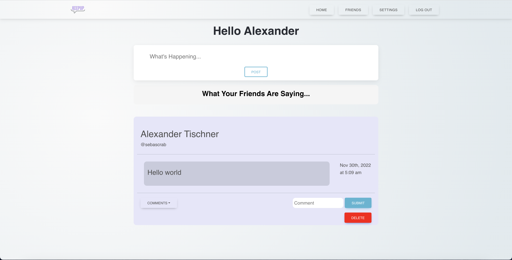

# Keep Up
  
  ## ReadMe Description 

  This is a social media applicaiton where users can log in, and start posting! Users can comment and delete their own posts as well. This was a group project made with Tommy, Ryan, Abel, and Sebastian.  
  ## Table of Contents: 

  * [Installation](#installation) 

  * [Contributors](#contributors) 

  * [Usage](#usage) 

  * [Tests](#tests) 

  * [License](#license) 

  ## Name: 

  Sebastian Tischner

  ## Installation 

  No installation needed. 

  ## Contributors 

  Fork Repo and request pull request. 

  ## Usage 

  Sign up, login, and post! 
   
  ## Tests 

  No tests

  ## License 
 
  This project is protected by the MIT license.

  Github: [Sebascrab](https://github.com/Sebascrab) 

  Email: alexanders.tischner@outlook.com  

  

  Deployed Link: [Keep Up](https://keep-up-project-3.herokuapp.com/) 

  

  

